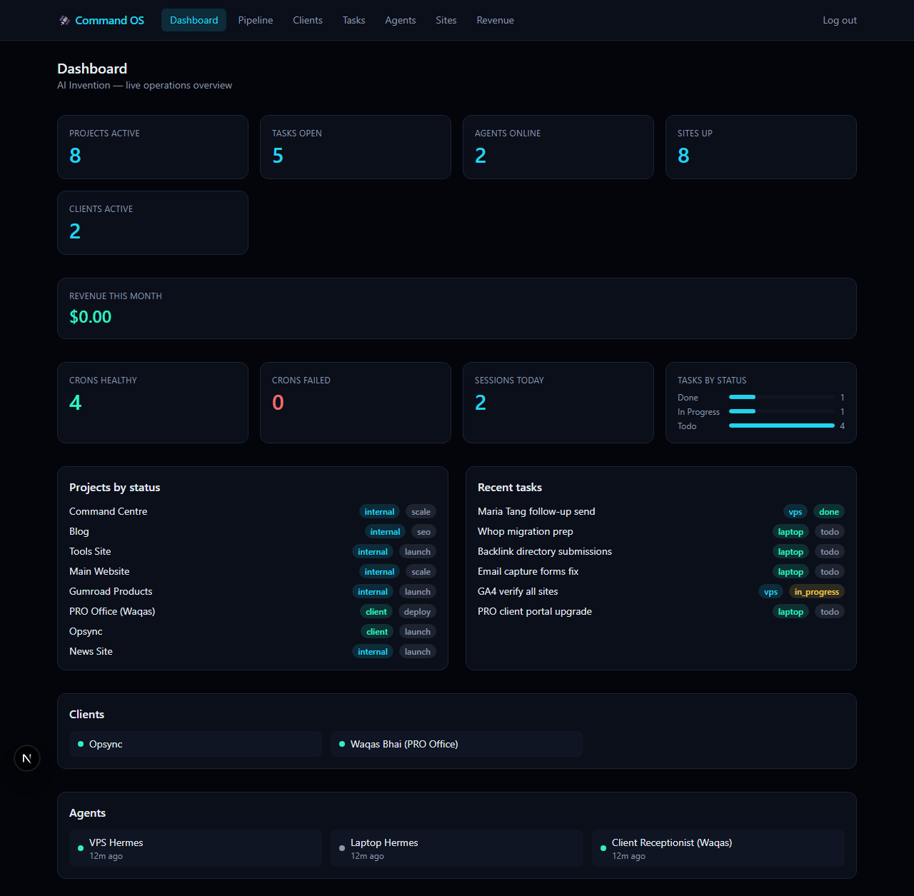
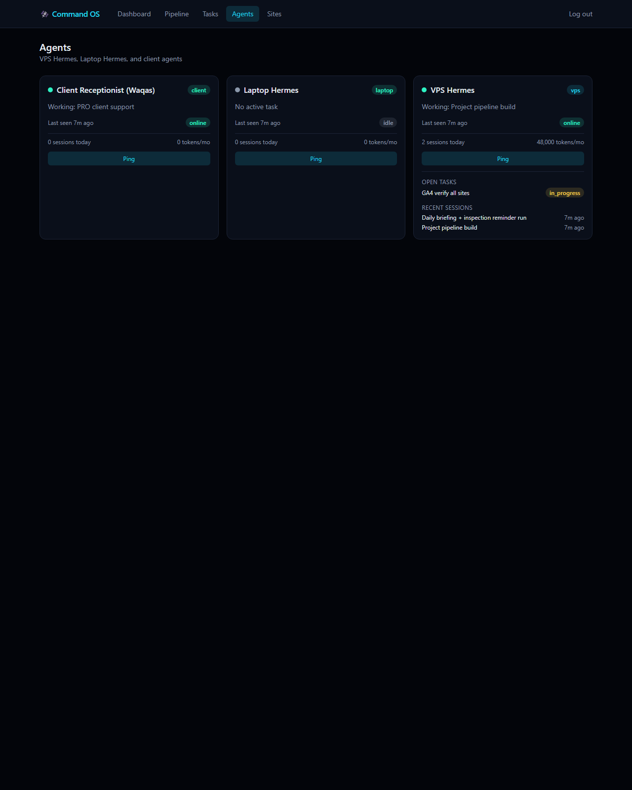
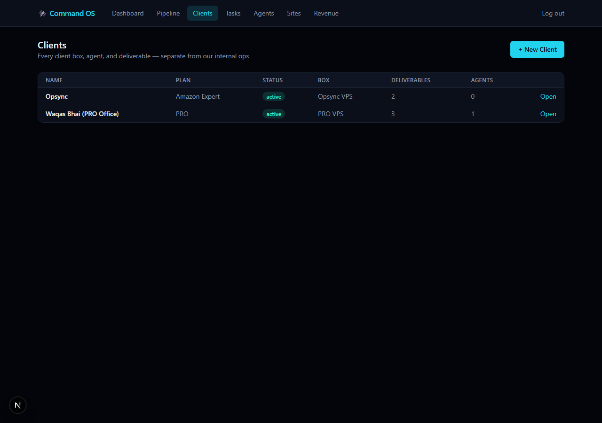
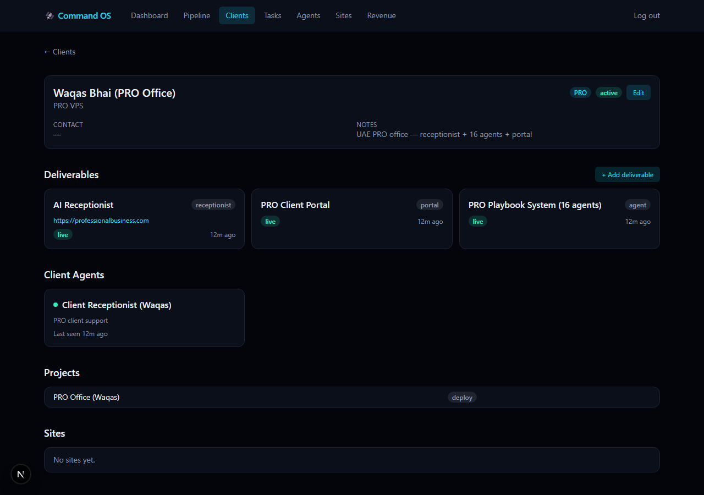
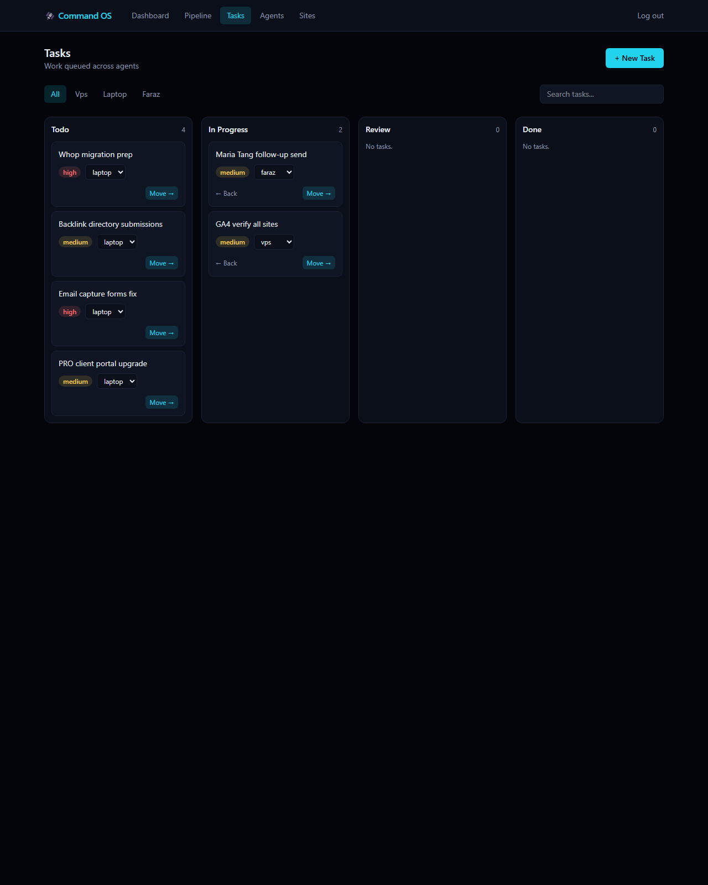
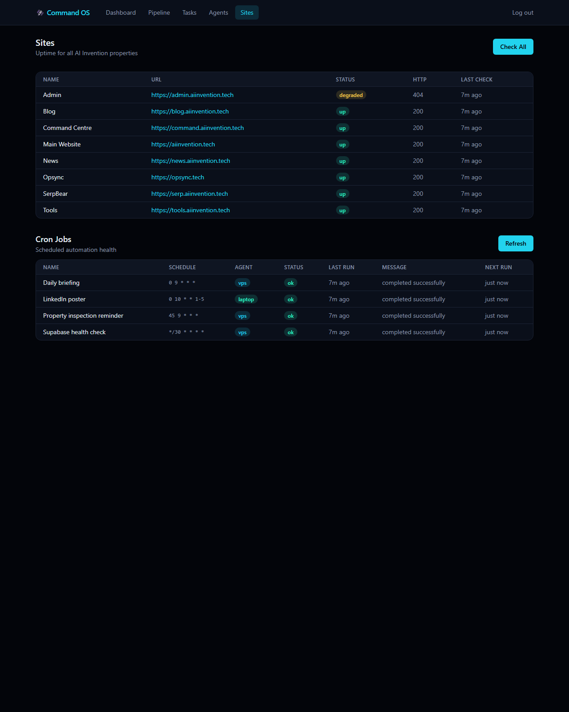
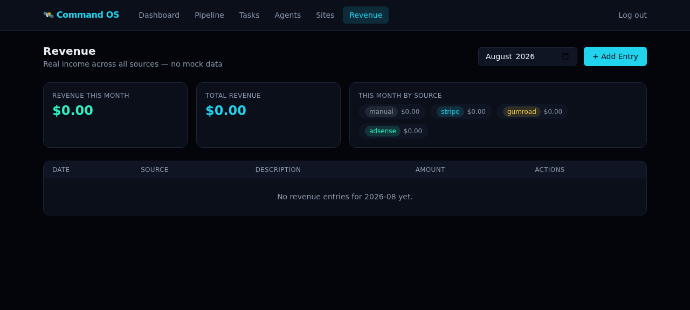
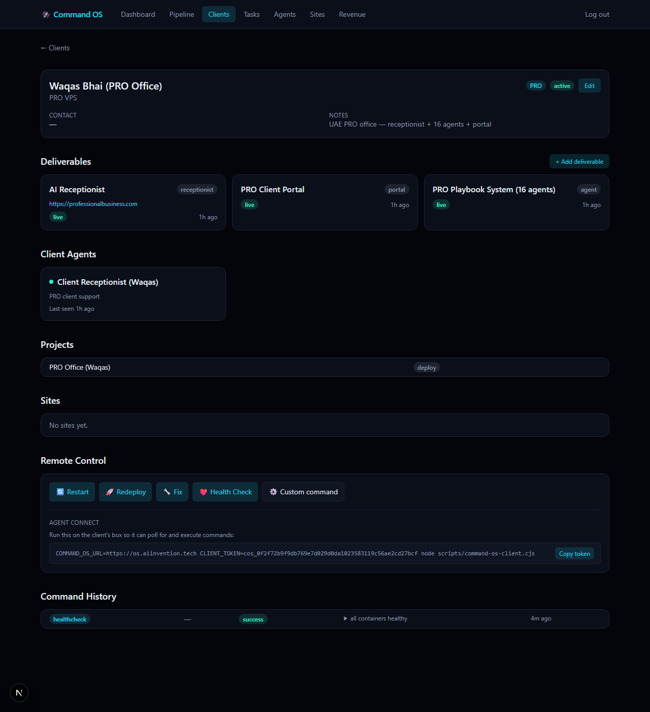

# AI Invention Command OS

Self-hosted control dashboard for AI agents, projects, sites, and revenue.

[](LICENSE)
[](https://nextjs.org)
[](https://nodejs.org)

## Screenshots

| Dashboard | Agents |
|---|---|
|  |  |

| Clients | Client Workspace |
|---|---|
|  |  |

| Tasks | Sites |
|---|---|
|  |  |

| Revenue | Remote Control |
|---|---|
|  |  |

## What It Does

**Command Dashboard**
- Live stats: active projects, open tasks, agents online, sites up
- Revenue this month, crons healthy/failed, sessions today, tasks by status

**Project Pipeline Board**
- 9-phase pipeline (Idea → Research → Design → Build → Deploy → SEO → Launch → Scale → Done)
- Internal + client projects, priority, next action, per-project phase tracking

**Agent Control Plane**
- Task inbox with agent assignment (vps / laptop / faraz / none) and status columns
- Agent registry with heartbeat, current task, session and token usage tracking

**Monitoring**
- Site uptime checks, cron job health, GitHub Actions CI status across your repos
- MCP server — any AI agent can read and write the OS directly over stdio

**Multi-Client Tenancy**
- Every client gets a workspace — their own box, agents, projects, sites, and deliverables
- Client agents (e.g. a receptionist) are kept separate from internal (VPS/Laptop) agents

**Remote-Exec / Command Queue**
- Restart, redeploy, fix, health-check, or run a custom command on any client's box
- Pull-based connect-back — the client box polls with its own token, executes, and reports the result. Command OS never holds SSH credentials for client boxes
- Full command history per client with status, result, and timing

## Quick Start

### Docker

```bash
docker compose up -d
```

Open `http://localhost:3000/setup`, create the admin account, then log in. Data persists in the `command-os-data` volume.

### Manual

Requires **Node 24+** (uses the built-in `node:sqlite` module — no native build step, no external database).

```bash
pnpm install
pnpm build
pnpm start
```

## MCP Server

Any AI agent can connect to Command OS as an MCP server over stdio:

```bash
node scripts/command-os-mcp.cjs
```

The server initializes its own database on first run — no need to start the Next.js app first. It exposes 17 tools:

`tasks_list` · `tasks_create` · `tasks_update` · `projects_list` · `agents_list` · `agents_heartbeat` · `sites_list` · `sites_check` · `crons_list` · `revenue_list` · `clients_list` · `clients_get` · `deliverables_list` · `deliverables_create` · `commands_create` · `commands_list` · `commands_get`

## What's Inside

| Table | Purpose |
|---|---|
| `projects` | Pipeline entries — internal + client work, phase, priority, next action |
| `tasks` | Work items assigned to agents, tracked through todo → in progress → review → done |
| `agents` | Registry of connected agents — status, heartbeat, session/token usage |
| `clients` | Client tenants — their box, plan, status, contact, notes |
| `deliverables` | What we've shipped for each client — receptionist, portal, dashboard, etc. |
| `sites` | Uptime tracking for your properties |
| `cron_jobs` | Scheduled automation health |
| `sessions` | Agent work sessions with token usage |
| `revenue` | Real income entries by source — no mock data, ever |
| `commands` | Remote-exec command queue — restart/redeploy/fix/healthcheck/custom, dispatched to client boxes via connect-back |

## Who Is This For

Solo founders, small AI agencies, and self-hosters who run multiple AI agents across multiple projects and want one dashboard — and one MCP endpoint — to see and control all of it.

## Roadmap

- Full Command Centre — client billing, Stripe subscriptions
- GA4 / AdSense integration
- One-click deploy buttons

## ⭐ Star This Repo

If this helps you run your agency, give it a ⭐ — it keeps us building.

**What would you improve? What do you want more of?** Tell us in [GitHub Discussions](https://github.com/faraz-jb/ai-invention-command-os/discussions).

## License

MIT — see [LICENSE](LICENSE).

---

Built by AI Invention — playbook-driven AI agency. [aiinvention.tech](https://aiinvention.tech)
